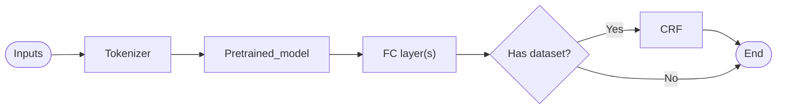

# Coleridge Initiative - Show US the Data
This is a repo created when participating in **Coleridge Initiative - Show US the Data** in Kaggle. 

Since I joined this competition a little bit late, not much was done. The approach is outlined as below:

## Problem outline and prerequisites
### Problem outline
The goal of this competition is to identify public datasets used in research papers published in the US. Thus, the goal is formulated as a NER task, with the only tags are B-dataset, I-dataset and O.

### Download data
Run the code below to download the data from kaggle

```kaggle competitions download -p "data/raw_data" mlb-player-digital-engagement-forecasting```

## Approach
Due to the time constraint, pretrained models are utilized, namely DistilBERT (specifically for development stage) and BERT. 

Documents are first tokenized into sentences, and each sentence is used as inputs to the model. Using pretrained tokenizer provided by Huggingface.co, then it is passed through a pretrained model to extract the features from its last hidden layer. Then the features are fed into fully-connected layer(s) and CRF to determine whether the sentence has dataset in it and the tag of each token respectively. The objective loss of the model is calculated as the sum of the loss from each task.

Due to the imbalanceness in the data (substaintially more sentences without dataset then sentences with dataset), undersampling is performed. It also helps in reducing the training time.

The inference processis outlined as follow:

